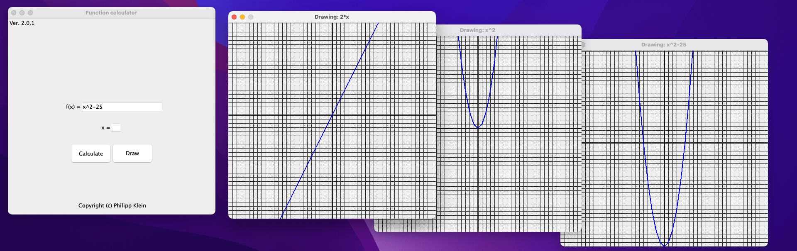

<h1>Math Function Calculator</h1>
<i>Published on: Monday, 06.12.2023 </i>
<i>Languages: Java </i>
<i>Version: 2.0.1 </i>
 

[Get Documentation](documents/MathFunctionCalculatorInformation.pdf)

This program lets you calculate and draw a mathematical function. The calculator is array-based. The dashboard and drawing interface are built using JFrames.

When you first launch the JAR-File you’ll find yourself on the dashboard:

In the text field, currently with the text „Type…“ you can type in your function. Not every function is supported e.g. sin, cos are not supported. The function calculator is very limited! In the text field, with the „x = “ on the left, you input the value for x. If you mistakenly entered a character, left the field blank or entered a number with a character, you’ll receive an error message as well.

When the function you've put in is accepted, and you press the 'Draw' button, a drawing window will open, displaying the function.

Note: the window has a size of 500x500 pixels, resulting in 50x50 blocks.
